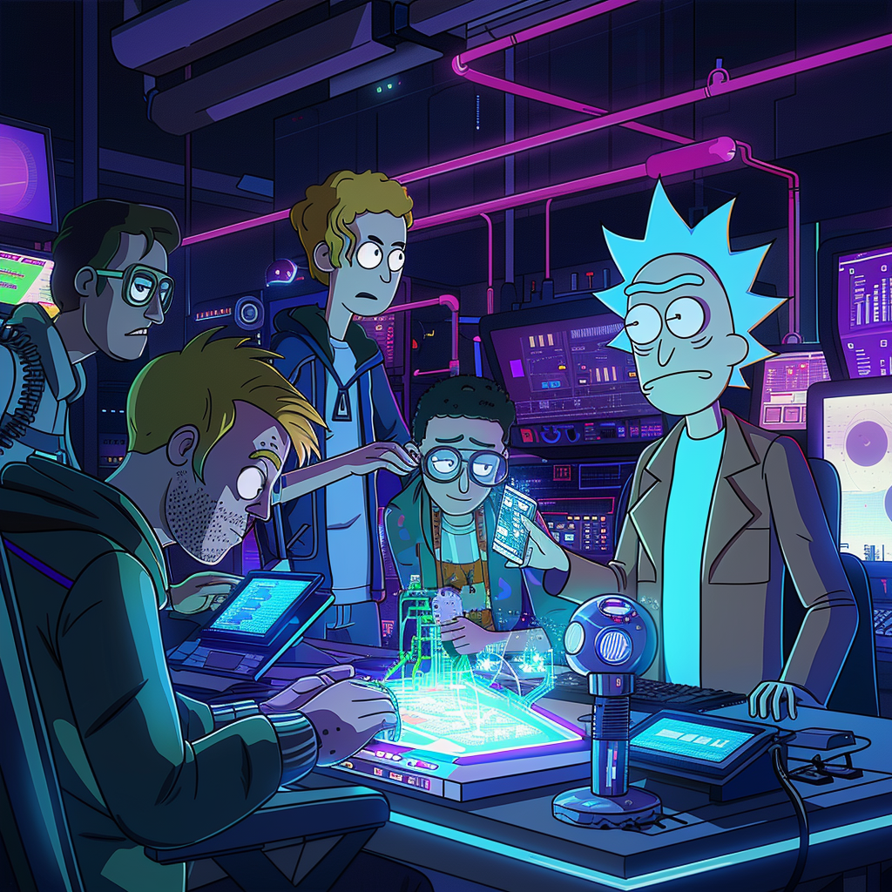

**Exercise: Collaborative RPG Battle Game**

In this exercise, students will work in groups to create an engaging RPG battle game. Each group will develop a separate program that contributes to the overall game experience. The programs will interact with each other, showcasing the power of collaboration and modular programming.

**Project 1: Character and Enemy Creation**
- The first group will create a program that allows users to create their game character and generates enemies.
- The program will prompt the user for input using the `Scanner` class to gather information such as the character's name, gender, and class (e.g., warrior, mage, rogue).
- The character's attributes (e.g., health, attack, defense) will be randomly generated based on the selected class.
- The program will use an `enum` to represent the different character classes.
- The character information will be stored in a `HashMap` where the keys are the attribute names and the values are the corresponding attribute values.
- The program will also generate a set of enemies with random attributes (e.g., health, attack, defense).
- Each enemy will be represented by a class that inherits from a common `Enemy` class.
- The enemy information will be stored in an `ArrayList`.
- The program will output the character and enemy information as separate JSON files using the Gson library.

**Project 2: Battle Simulator**
- The second group will create a program that reads the character and enemy information from the JSON files generated by Project 1.
- The program will use the Gson library to parse the JSON files and recreate the character and enemy objects.
- The program will simulate a battle between the character and the enemies.
- The battle will consist of multiple rounds, where the character and enemies take turns attacking each other.
- The damage dealt by each attack will be calculated based on the attacker's attack attribute and the defender's defense attribute.
- The program will use a random number generator to determine if the character receives help in each round (e.g., a health potion, a temporary attack boost).
- The battle will continue until either the character or all the enemies are defeated.
- The program will display the battle progress, including the health status of the character and enemies after each round.
- At the end of the battle, the program will output the result (victory or defeat) and the final stats of the character.

**Testing Requirements**
- Each program should have a minimum of 80% line coverage using JUnit 5 tests.
- The tests should cover various scenarios, such as different character classes, enemy types, and battle outcomes.
- The tests should also validate the JSON input and output to ensure data integrity.

**Collaboration**
- The students will work together to define the structure and format of the JSON files for seamless data exchange between the programs.
- They will also collaborate on designing the battle mechanics, including the attack and defense calculations, and the random events during the battle.
- Students will have to create separate repositories for each project and share the GitHub link with the other team. It is important that they decide the JSON format at the beginning so they can work asynchronously.

**Development Environment**
- The projects will be developed using Maven for easy dependency management and project structure.
- The students will utilize Java programming language features such as classes, inheritance, interfaces, enums, `HashMap`, `ArrayList`, and file I/O.
- The Gson library will be used for JSON serialization and deserialization.